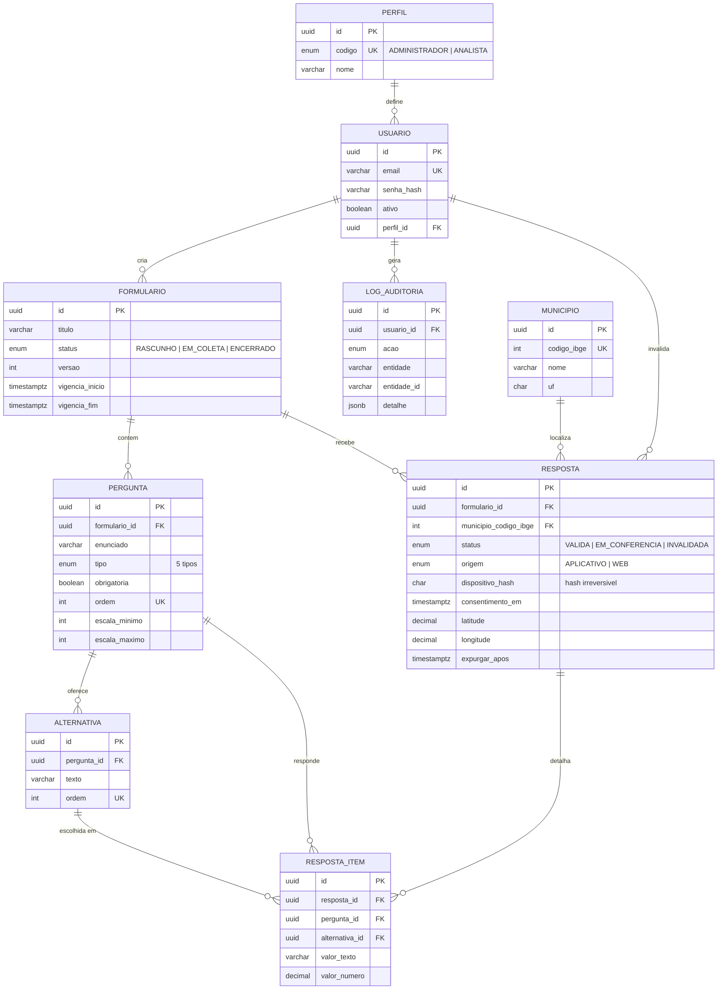

# Modelagem do Banco de Dados

Sistema de Pesquisa Eleitoral — PostgreSQL 16 + Prisma.
Corresponde ao item 5.2 do documento de escopo (task **S0-03**), com as ampliações das
Sprints 1 (sessão), 2 (tipo ESCALA na pergunta), 3 (lógica condicional e token público) e
5 (sessão de coleta, marcações de suspeita e views materializadas) e 6 (agregação detalhada do
painel).

Fonte de verdade: [`apps/api/prisma/schema.prisma`](../apps/api/prisma/schema.prisma).
Migrations em `apps/api/prisma/migrations/`.

## Diagrama

## Decisões que o diagrama não mostra

**Chave primária.** Todas as tabelas usam `uuid`. O `municipio` também tem `uuid` como PK,
mas o relacionamento com `resposta` é feito pelo `codigo_ibge` (`UNIQUE`), e não pelo uuid:
a apuração por município é o objetivo central do sistema e o código IBGE é a chave de negócio.
Nome de município não é replicado em nenhuma outra tabela.

**Timestamps.** Todos em `timestamptz(6)`.

**Resposta e resposta_item separadas.** Nunca achatadas em JSON: a apuração depende de
agregar por pergunta e alternativa.

**Anonimato.** Nenhuma coluna de `resposta` identifica o respondente. O controle de
duplicidade usa apenas `dispositivo_hash` (`char(64)`, hash irreversível). A geolocalização
é opcional e serve só para conferência.

**Invalidação.** `resposta` nunca é excluída fisicamente. Invalidar é mudar `status` para
`INVALIDADA`, com data e motivo obrigatórios (`ck_resposta_invalidacao_coerente`). O registro
permanece e sai da contagem.

## Objetos escritos à mão na migration

O Prisma não modela índice parcial, `CHECK` nem comentário de coluna. Todos vivem dentro do
`migration.sql` da migration correspondente — nunca em `.sql` solto fora do controle de
migrations.

| Objeto | Tipo | Papel |
|---|---|---|
| `uq_resposta_dispositivo_ativo` | índice único parcial | uma resposta ativa por dispositivo e formulário; resposta invalidada não bloqueia novo envio |
| `ix_resposta_em_conferencia` | índice parcial | fila de conferência manual |
| `ix_resposta_expurgar_apos` | índice parcial | rotina automática de expurgo (4 anos) |
| `ck_resposta_item_valor_unico` | CHECK | o item guarda alternativa OU texto OU número, nunca dois |
| `ck_resposta_invalidacao_coerente` | CHECK | invalidação sempre com data e motivo |
| `ck_resposta_geolocalizacao_completa` | CHECK | latitude e longitude vêm juntas ou não vêm |
| `ck_resposta_geolocalizacao_faixa` | CHECK | coordenada dentro da faixa válida |
| `ck_municipio_codigo_ibge_7_digitos` | CHECK | código IBGE com 7 dígitos |
| `ck_municipio_uf_formato` | CHECK | UF com duas letras maiúsculas |
| `ck_formulario_vigencia` | CHECK | fim da vigência nunca antes do início |
| `ck_pergunta_escala_coerente` | CHECK | configuração de escala só no tipo ESCALA, e sempre completa |
| `ck_pergunta_escala_faixa` | CHECK | escala dentro de 0 a 10 |
| `ck_pergunta_ordem_positiva` | CHECK | ordem de pergunta sempre positiva |
| `ck_alternativa_ordem_positiva` | CHECK | ordem de alternativa sempre positiva |
| `ck_sessao_encerramento_coerente` | CHECK | encerramento de sessão com data e motivo juntos |
| `ck_sessao_expiracao_posterior` | CHECK | expiração sempre depois da criação |
| `ix_sessao_ativa` | índice parcial | varredura de sessões vivas |
| `tg_pergunta_condicao_valida` | constraint trigger (deferido) | condição sempre no mesmo formulário, em pergunta de escolha única e de ordem anterior |
| `ck_formulario_token_publico_coerente` | CHECK | rascunho sem token público; publicado e encerrado sempre com |
| `ck_resposta_duracao_nao_negativa` | CHECK | duração de preenchimento nunca negativa |
| `ck_sessao_coleta_expiracao_posterior` | CHECK | sessão de coleta expira depois de começar |
| `ix_sessao_coleta_aberta` | índice parcial | sessões abertas, usadas na validação do envio |
| `mv_resumo_formulario` | view materializada | totais por formulário, base dos percentuais |
| `mv_resultado_pergunta` | view materializada | total e percentual por alternativa, sobre válidas |
| `mv_resultado_municipio` | view materializada | apuração por código IBGE |
| `mv_resultado_detalhado` | view materializada | fato do painel: pergunta × alternativa × município × dia |
| `mv_evolucao_coleta` | view materializada | série diária por formulário e município |
| `mv_alcance_municipio` | view materializada | respostas válidas por município |

## Índices de apuração

- `resposta (formulario_id, status)`
- `resposta (formulario_id, municipio_codigo_ibge, status)` — apuração por município
- `resposta (recebido_em)`
- `resposta_item (pergunta_id, alternativa_id)` — contagem por alternativa
- `municipio (uf, nome)` — busca do município na tela de coleta

As **views materializadas** de agregação foram criadas na Sprint 5, escritas à mão dentro da
migration e atualizadas por tarefa periódica. Detalhes em [integridade.md](./integridade.md).

## Carga inicial

`apps/api/prisma/seed.ts` carrega apenas dado de referência, de forma idempotente:

- os dois perfis de acesso (`ADMINISTRADOR`, `ANALISTA`);
- os **417 municípios da Bahia**, de `prisma/data/municipios-ba.json`, gerado da API de
  localidades do IBGE por `npm run municipios:sync`.

O seed não cria usuário e não cria dado de resposta.

## Retenção

| Dado | Prazo | Coluna |
|---|---|---|
| Resposta | 4 anos após o encerramento da pesquisa | `resposta.expurgar_apos` |
| Dado técnico de duplicidade (`dispositivo_hash`) | encerramento da coleta | — |

A rotina é automática, nunca manual. A implementação entra na sprint do módulo de
integridade; o schema já reserva a coluna e o índice parcial que ela usa.
