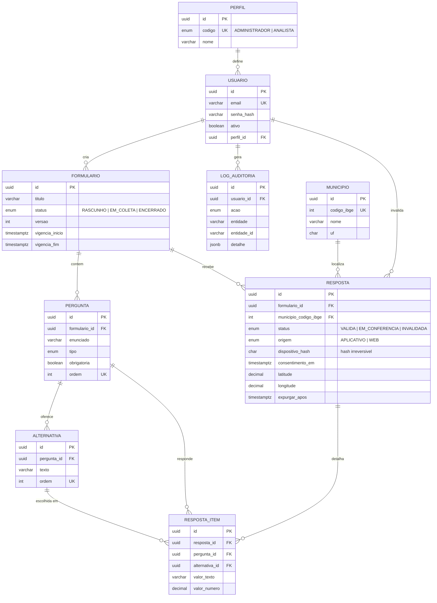

# Modelagem do Banco de Dados

Sistema de Pesquisa Eleitoral — PostgreSQL 16 + Prisma.
Corresponde ao item 5.2 do documento de escopo e à task **S0-03**.

Fonte de verdade: [`apps/api/prisma/schema.prisma`](../apps/api/prisma/schema.prisma).
Script aplicado: `apps/api/prisma/migrations/20260823120000_estrutura_inicial/migration.sql`.

## Diagrama

## Decisões que o diagrama não mostra

**Chave primária.** Todas as tabelas usam `uuid`. O `municipio` também tem `uuid` como PK,
mas o relacionamento com `resposta` é feito pelo `codigo_ibge` (`UNIQUE`), e não pelo uuid:
a apuração por município é o objetivo central do sistema e o código IBGE é a chave de negócio.
Nome de município não é replicado em nenhuma outra tabela.

**Timestamps.** Todos em `timestamptz(6)`.

**Resposta e resposta_item separadas.** Nunca achatadas em JSON: a apuração depende de
agregar por pergunta e alternativa.

**Anonimato.** Nenhuma coluna de `resposta` identifica o respondente. O controle de
duplicidade usa apenas `dispositivo_hash` (`char(64)`, hash irreversível). A geolocalização
é opcional e serve só para conferência.

**Invalidação.** `resposta` nunca é excluída fisicamente. Invalidar é mudar `status` para
`INVALIDADA`, com data e motivo obrigatórios (`ck_resposta_invalidacao_coerente`). O registro
permanece e sai da contagem.

## Objetos escritos à mão na migration

O Prisma não modela índice parcial, `CHECK` nem comentário de coluna. Todos vivem dentro do
`migration.sql` da migration inicial — nunca em `.sql` solto fora do controle de migrations.

| Objeto | Tipo | Papel |
|---|---|---|
| `uq_resposta_dispositivo_ativo` | índice único parcial | uma resposta ativa por dispositivo e formulário; resposta invalidada não bloqueia novo envio |
| `ix_resposta_em_conferencia` | índice parcial | fila de conferência manual |
| `ix_resposta_expurgar_apos` | índice parcial | rotina automática de expurgo (4 anos) |
| `ck_resposta_item_valor_unico` | CHECK | o item guarda alternativa OU texto OU número, nunca dois |
| `ck_resposta_invalidacao_coerente` | CHECK | invalidação sempre com data e motivo |
| `ck_resposta_geolocalizacao_completa` | CHECK | latitude e longitude vêm juntas ou não vêm |
| `ck_resposta_geolocalizacao_faixa` | CHECK | coordenada dentro da faixa válida |
| `ck_municipio_codigo_ibge_7_digitos` | CHECK | código IBGE com 7 dígitos |
| `ck_municipio_uf_formato` | CHECK | UF com duas letras maiúsculas |
| `ck_formulario_vigencia` | CHECK | fim da vigência nunca antes do início |

## Índices de apuração

- `resposta (formulario_id, status)`
- `resposta (formulario_id, municipio_codigo_ibge, status)` — apuração por município
- `resposta (recebido_em)`
- `resposta_item (pergunta_id, alternativa_id)` — contagem por alternativa
- `municipio (uf, nome)` — busca do município na tela de coleta

As **views materializadas** de agregação, que o painel consome, entram na sprint do módulo de
resultados. Serão escritas à mão dentro da migration correspondente e atualizadas por job BullMQ.

## Carga inicial

`apps/api/prisma/seed.ts` carrega apenas dado de referência, de forma idempotente:

- os dois perfis de acesso (`ADMINISTRADOR`, `ANALISTA`);
- os **417 municípios da Bahia**, de `prisma/data/municipios-ba.json`, gerado da API de
  localidades do IBGE por `npm run municipios:sync`.

O seed não cria usuário e não cria dado de resposta.

## Retenção

| Dado | Prazo | Coluna |
|---|---|---|
| Resposta | 4 anos após o encerramento da pesquisa | `resposta.expurgar_apos` |
| Dado técnico de duplicidade (`dispositivo_hash`) | encerramento da coleta | — |

A rotina é automática (BullMQ), nunca manual. A implementação entra na sprint do módulo de
integridade; o schema já reserva a coluna e o índice parcial que ela usa.
